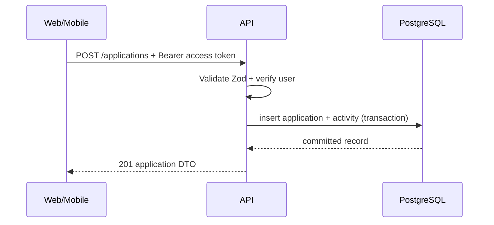

# REST API Contract

Base URL: `/api/v1`. Semua endpoint JSON. Error mengikuti format tunggal:

```json
{ "error": { "code": "VALIDATION_ERROR", "message": "Input tidak valid", "fields": { "email": ["Format email tidak valid"] } } }
```

## 1. Auth

| Method | Path | Auth | Fungsi |
| --- | --- | --- | --- |
| POST | `/auth/register` | No | Buat akun dan session pertama |
| POST | `/auth/login` | No | Login dengan email/password |
| POST | `/auth/refresh` | Refresh cookie/token | Rotasi refresh token, access token baru |
| POST | `/auth/logout` | Yes | Cabut session perangkat saat ini |
| GET | `/auth/me` | Yes | Profil session aktif |

`POST /auth/login` request:

```json
{ "email": "morriz@example.com", "password": "min-12-karakter" }
```

Response auth selalu berisi access token singkat dan data user; refresh token ditangani transport aman per platform.

## 2. Applications

| Method | Path | Fungsi |
| --- | --- | --- |
| GET | `/applications` | Daftar dengan filter/pagination |
| POST | `/applications` | Buat application |
| GET | `/applications/:id` | Detail lengkap milik user |
| PATCH | `/applications/:id` | Edit field atau status |
| POST | `/applications/:id/archive` | Archive |
| POST | `/applications/:id/restore` | Keluarkan dari archive |
| DELETE | `/applications/:id` | Soft delete |

Query daftar: `status`, `type`, `q`, `archived`, `deadlineFrom`, `deadlineTo`, `page`, `limit`, `sort`.

```json
{
  "title": "Backend Intern",
  "organizationName": "Contoh Teknologi",
  "type": "INTERNSHIP",
  "status": "WISHLIST",
  "sourceUrl": "https://example.com/jobs/123",
  "deadlineAt": "2026-10-05T16:59:00.000Z"
}
```

## 3. Children of an application

| Method | Path | Fungsi |
| --- | --- | --- |
| GET/POST | `/applications/:id/notes` | List/tambah catatan |
| PATCH/DELETE | `/applications/:id/notes/:noteId` | Ubah/hapus catatan |
| GET/POST | `/applications/:id/contacts` | List/tambah kontak |
| PATCH/DELETE | `/applications/:id/contacts/:contactId` | Ubah/hapus kontak |
| GET | `/applications/:id/activities` | Timeline immutable |

## 4. Reminders dan dashboard

| Method | Path | Fungsi |
| --- | --- | --- |
| GET/POST | `/reminders` | Daftar/buat reminder user |
| PATCH/DELETE | `/reminders/:id` | Edit/batalkan reminder pending |
| GET | `/dashboard/summary` | Counts per status, upcoming deadlines, recent activity |

## 5. Kontrak dan validasi

- Semua input menggunakan Zod shared; backend tetap parse ulang input.
- UUID parameter divalidasi sebelum query.
- Endpoint detail dan child resource selalu cek ownership parent application.
- Pagination menggunakan limit default 20, maksimum 100.
- Response list: `{ data, meta: { page, limit, total, hasNextPage } }`.

## 6. API flow


