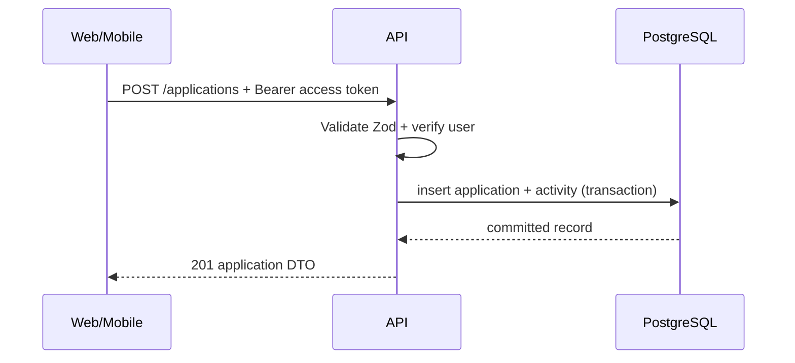

# REST API Contract

Base URL: `/api/v1`. Semua endpoint JSON. Error mengikuti format tunggal:

```json
{
  "error": {
    "code": "VALIDATION_ERROR",
    "message": "Input tidak valid",
    "fields": { "email": ["Format email tidak valid"] }
  }
}
```

## 0. Health

| Method | Path      | Auth | Fungsi                                   |
| ------ | --------- | ---- | ---------------------------------------- |
| GET    | `/health` | No   | Memastikan API hidup dan PostgreSQL siap |

Health check menjalankan query PostgreSQL minimal. Respons sukses harus persis:

```json
{ "status": "ok" }
```

Endpoint tidak boleh mengembalikan connection string, versi database, latency,
stack trace, atau detail internal lain. Kegagalan database memakai error generik
API dan status non-2xx.

## 1. Auth

| Method | Path             | Auth                 | Fungsi                                  |
| ------ | ---------------- | -------------------- | --------------------------------------- |
| POST   | `/auth/register` | No                   | Buat akun dan session pertama           |
| POST   | `/auth/login`    | No                   | Login dengan email/password             |
| POST   | `/auth/refresh`  | Refresh cookie/token | Rotasi refresh token, access token baru |
| POST   | `/auth/logout`   | Refresh cookie/token | Cabut session perangkat saat ini        |
| GET    | `/auth/me`       | Yes                  | Profil session aktif                    |

`POST /auth/login` request:

```json
{ "email": "morriz@example.com", "password": "min-12-karakter" }
```

Register request memakai field berikut:

```json
{
  "email": "morriz@example.com",
  "password": "min-12-karakter",
  "displayName": "Morriz",
  "timezone": "Asia/Jakarta"
}
```

Semua request auth yang membuat atau memakai session mengirim header `X-Client-Platform` bernilai `web` atau `mobile`.

- Web menerima refresh token sebagai cookie `sei_refresh_token` (`httpOnly`, `sameSite=lax`, `secure` pada production, path `/api/v1/auth`). Browser tidak menerima refresh token di JSON dan tidak menyimpannya pada JavaScript-readable storage. Refresh dan logout web tidak membutuhkan body.
- Mobile mengirim body `{ "refreshToken": "..." }` pada refresh/logout dan menerima refresh token baru di JSON. Client wajib menyimpannya di Expo SecureStore, bukan AsyncStorage.
- Register dan login mengembalikan `{ "accessToken": "...", "user": { "id", "email", "displayName", "timezone" } }`; mobile juga menerima `refreshToken` pada response. Access token berlaku singkat dan disimpan di memory client.
- Refresh selalu mencabut token lama dan mengeluarkan access token serta refresh token baru. Token lama tidak dapat dipakai ulang.

## 2. Applications

| Method | Path                        | Fungsi                          |
| ------ | --------------------------- | ------------------------------- |
| GET    | `/applications`             | Daftar dengan filter/pagination |
| POST   | `/applications`             | Buat application                |
| GET    | `/applications/:id`         | Detail lengkap milik user       |
| PATCH  | `/applications/:id`         | Edit field atau status          |
| POST   | `/applications/:id/archive` | Archive                         |
| POST   | `/applications/:id/restore` | Keluarkan dari archive          |
| DELETE | `/applications/:id`         | Soft delete                     |

Semua endpoint application membutuhkan Bearer access token. Resource milik user lain atau yang sudah di-soft-delete mengembalikan 404 generik.

Query daftar: `status`, `type`, `q`, `archived`, `deadlineFrom`, `deadlineTo`, `page`, `limit`, `sort`.

- `archived` default `false` (hanya application aktif). `true` menampilkan yang diarsip.
- `q` mencari `title` dan `organizationName`.
- `page` default 1; `limit` default 20, maksimum 100.
- `sort` allowlist: `updatedAt_desc` (default), `updatedAt_asc`, `deadlineAt_asc`, `deadlineAt_desc`, `createdAt_desc`, `createdAt_asc`.
- Response list: `{ "data": [...], "meta": { "page", "limit", "total", "hasNextPage" } }`.

Membuat application menyimpan record dan activity `CREATED` dalam satu transaction. Mengubah `status` menyimpan `STATUS_CHANGED` sekali per perubahan. Archive/restore/delete menulis activity `ARCHIVED`, `RESTORED`, atau `DELETED`. Timeline activity bersifat immutable (hanya GET).

`appliedAt` boleh kosong pada `WISHLIST` dan diisi otomatis (tanggal UTC) ketika status pertama kali menjadi `APPLIED` jika klien belum mengirim nilainya.

```json
{
  "title": "Backend Intern",
  "organizationName": "Contoh Teknologi",
  "type": "INTERNSHIP",
  "status": "WISHLIST",
  "sourceUrl": "https://example.com/jobs/123",
  "deadlineAt": "2026-10-05T16:59:00.000Z"
}
```

## 3. Children of an application

| Method       | Path                                    | Fungsi              |
| ------------ | --------------------------------------- | ------------------- |
| GET/POST     | `/applications/:id/notes`               | List/tambah catatan |
| PATCH/DELETE | `/applications/:id/notes/:noteId`       | Ubah/hapus catatan  |
| GET/POST     | `/applications/:id/contacts`            | List/tambah kontak  |
| PATCH/DELETE | `/applications/:id/contacts/:contactId` | Ubah/hapus kontak   |
| GET          | `/applications/:id/activities`          | Timeline immutable  |

## 4. Reminders dan dashboard

| Method       | Path                 | Fungsi                                                 |
| ------------ | -------------------- | ------------------------------------------------------ |
| GET/POST     | `/reminders`         | Daftar/buat reminder user                              |
| PATCH/DELETE | `/reminders/:id`     | Edit/batalkan reminder pending                         |
| GET          | `/dashboard/summary` | Counts per status, upcoming deadlines, recent activity |

Semua endpoint reminder membutuhkan Bearer access token. Query dan mutation selalu dibatasi dengan `user_id`; reminder user lain mengembalikan 404 generik. `DELETE` tidak menghapus row, tetapi mengubah reminder `PENDING` menjadi `CANCELLED`.

`POST /reminders` menerima:

```json
{
  "applicationId": "00000000-0000-4000-8000-000000000002",
  "kind": "FOLLOW_UP",
  "dueAt": "2030-01-12T09:00:00.000Z"
}
```

`applicationId` boleh `null` untuk custom reminder. Bila diisi, application wajib milik user dan belum di-soft-delete. `dueAt` wajib ISO 8601 dengan offset dan harus berada setelah waktu saat request diproses. Setiap user dapat memiliki maksimum 100 reminder aktif (`PENDING` + `PROCESSING`); create berikutnya mengembalikan `409 Conflict` sampai salah satu reminder menjadi `SENT`, `FAILED`, atau `CANCELLED`.

`PATCH /reminders/:id` menerima sebagian dari `applicationId`, `kind`, dan `dueAt`, minimal satu field. Reminder hanya dapat diedit ketika berstatus `PENDING` dan `attemptCount === 0`; setelah delivery attempt dimulai, payload email telah dibekukan dan perubahan ditolak dengan `409 Conflict`. Reminder `PENDING` tetap dapat dibatalkan walaupun pernah dicoba. Status delivery, attempt count, error code, provider message ID, dan snapshot payload hanya dapat diubah oleh scheduler.

`GET /reminders` menerima `status`, `page`, dan `limit`; default page 1, default limit 20, maksimum 100. Response memakai envelope pagination umum. Reminder DTO berisi `id`, `userId`, `applicationId`, `kind`, `dueAt`, `sentAt`, `attemptCount`, `deliveryStatus`, `lastErrorCode`, `providerMessageId`, dan `createdAt`.

## 5. Kontrak dan validasi

- Semua input menggunakan Zod shared; backend tetap parse ulang input.
- UUID parameter divalidasi sebelum query.
- Endpoint detail dan child resource selalu cek ownership parent application.
- Pagination menggunakan limit default 20, maksimum 100.
- Response list: `{ data, meta: { page, limit, total, hasNextPage } }`.

## 6. API flow


