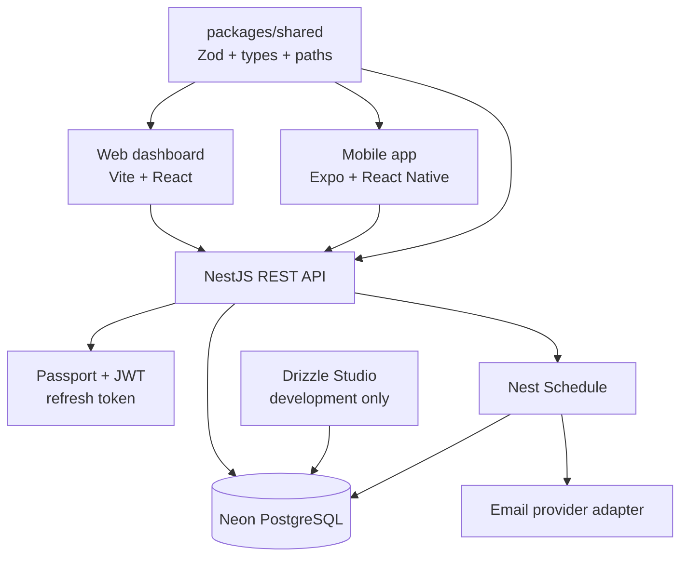
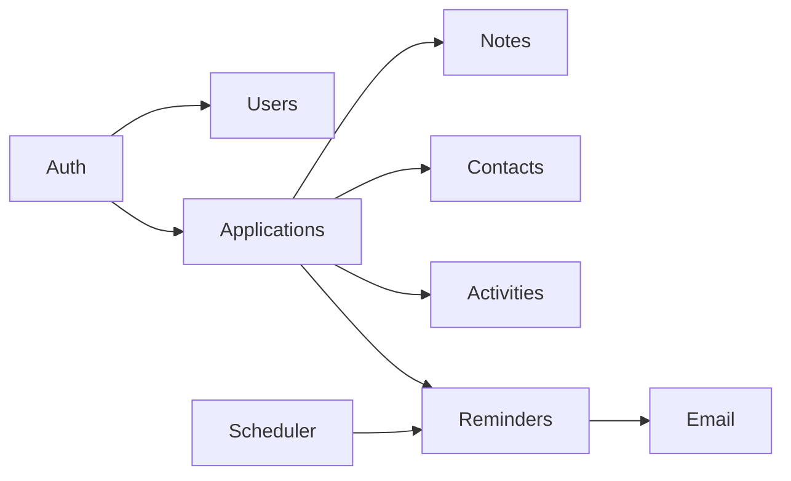

# Architecture Blueprint

## 1. Peta integrasi sistem



## 2. Tanggung jawab tiap bagian

| Bagian | Boleh menangani | Tidak boleh menangani |
| --- | --- | --- |
| Web/Mobile | Tampilan, validasi UX awal, cache request, state lokal | Authorization utama atau business rule final |
| API NestJS | Auth, ownership check, validasi final, schedule, transaction | Mengatur tampilan klien |
| Shared | Zod schemas, enum, DTO type, API paths | DB query atau environment secret |
| Drizzle | Schema SQL, migration, query yang teruji | Logic UI |
| Neon | Penyimpanan Postgres managed | Menyimpan JWT mentah atau provider secret |

## 3. Struktur monorepo

```text
job-tracker/
├── apps/
│   ├── api/                 # NestJS API
│   │   ├── src/modules/     # auth, users, applications, reminders
│   │   └── drizzle/         # schema, migrations, seed
│   ├── web/                 # Vite React dashboard
│   └── mobile/              # Expo application
├── packages/
│   ├── shared/              # Zod, types, enums, API constants
│   └── config/              # ESLint/TS config apabila diperlukan
├── docs/
├── docker-compose.yml       # postgres lokal saja
├── pnpm-workspace.yaml
└── turbo.json
```

## 4. Batas modul API



Setiap module memiliki controller, service, schema/DTO, test, dan repository/query layer. Controller tipis; service memegang aturan bisnis; query Drizzle tidak boleh tersebar di controller.

## 5. Environment

| Lingkungan | Database | Email | Tujuan |
| --- | --- | --- | --- |
| Local | Docker PostgreSQL | Mail sandbox/log transport | Pengembangan aman |
| Preview | Neon branch/database non-production | Provider sandbox | QA sebelum rilis |
| Production | Neon `job_tracker` | Provider production + domain terverifikasi | Pengguna nyata |

Drizzle Studio hanya boleh tersambung ke database local atau database development dengan credential terbatas.
