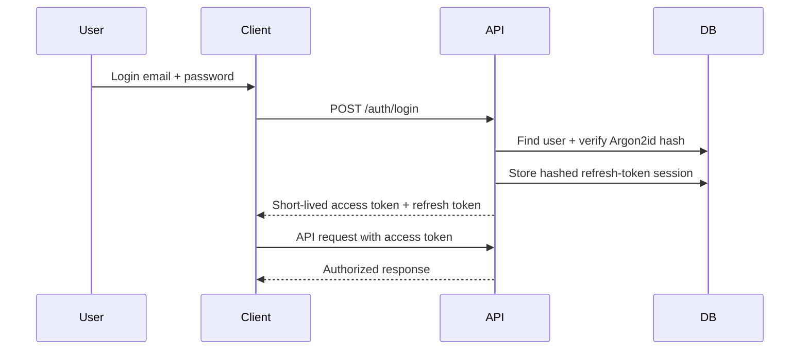

# Auth and Security Baseline

## 1. Threat boundary MVP

Data lamaran, email kontak, dan catatan interview bersifat privat. Target keamanan MVP adalah mencegah pengambilalihan akun umum, token bocor, dan akses lintas user. Ini bukan janji compliance enterprise.

## 2. Auth architecture



## 3. Aturan implementasi

- Password di-hash dengan Argon2id. Jangan log password, token, request authorization, atau connection string.
- Access token berumur pendek (contoh 15 menit); refresh token opaque berumur lebih panjang, menyimpan hash Argon2id di database, dan **dirotasi** setiap refresh.
- Web menyimpan refresh token di secure, httpOnly, sameSite cookie. Access token hanya di memory bila memungkinkan.
- Mobile menyimpan refresh token di `expo-secure-store`, bukan AsyncStorage. Access token juga tidak ditulis ke log.
- Tabel refresh token menyimpan hash token, expiry, revokedAt, device label opsional, dan createdAt.
- Logout mencabut refresh session aktif. Password change di fase berikutnya harus mencabut semua session.
- Rate-limit register/login/refresh; respons login salah jangan membocorkan apakah email terdaftar.
- CORS hanya origin web yang sah. Production HTTPS wajib.
- Request register/login/refresh/logout wajib mengirim `X-Client-Platform: web|mobile`. Header ini juga mencegah form lintas origin sederhana membuat atau mengganti session web; client browser yang tidak dipercaya tetap dibatasi preflight CORS.
- Release mobile wajib memakai `EXPO_PUBLIC_API_BASE_URL` HTTPS. HTTP hanya diterima pada build development dan host loopback/private LAN.

## 4. Authorization checklist

```text
Request → valid JWT → userId dari JWT
       → query resource dengan WHERE id = :id AND user_id = :userId
       → tidak ditemukan = 404 generik
       → ditemukan = lanjutkan operasi
```

Jangan pernah mengambil record by `id` lalu hanya membandingkan ownership setelah mengirim sebagian response.

## 5. Input dan operational security

- Zod validasi setiap boundary API; gunakan allowlist enum dan batas panjang string.
- Escape output UI secara default React; jangan merender note sebagai HTML mentah.
- URL divalidasi sebagai `https?`; tidak di-fetch server pada MVP untuk mencegah SSRF.
- `.env` tidak masuk git; sediakan `.env.example` tanpa nilai rahasia.
- Error production tidak menampilkan stack trace ke client; log server memakai request ID.
- Backup, domain email, dan credential Neon diatur terpisah dari source code.
- Alokasi persisten dibatasi per user dan check-plus-insert diserialisasi dengan advisory transaction lock: maksimum 1.000 application sepanjang histori, 5.000 note, 2.000 contact, serta 1.000 reminder sepanjang histori. Batas total reminder terpisah dari batas 100 reminder aktif. Delete note/contact membebaskan kuota; soft-delete application dan status terminal reminder tetap dihitung agar satu tenant tidak dapat menghabiskan storage bersama lewat create/delete loop.
