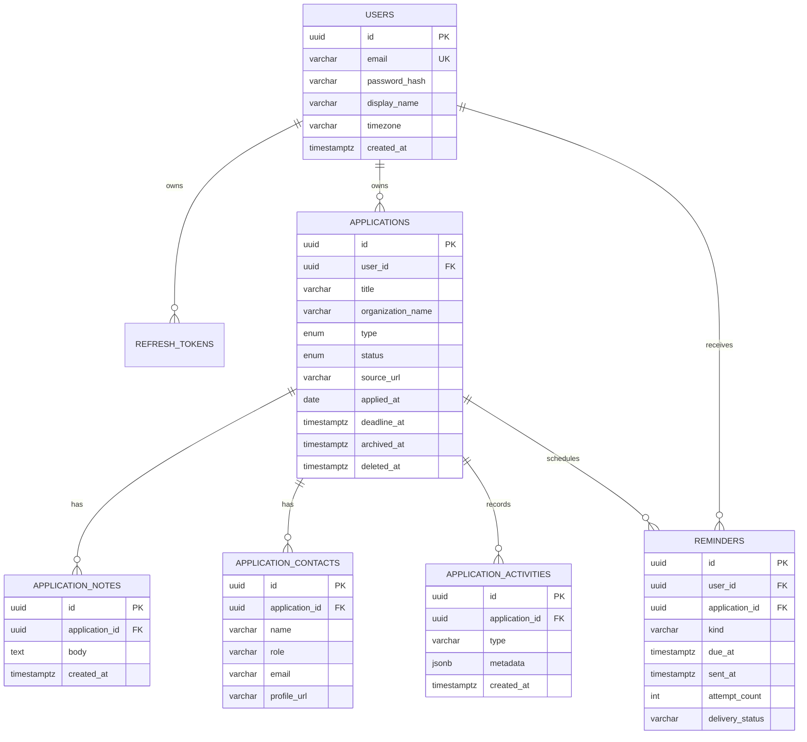

# Data Model and ERD

## 1. ERD



## 2. Enum yang dibagi melalui `packages/shared`

```ts
export const applicationType = ['JOB', 'INTERNSHIP', 'FREELANCE'] as const;
export const applicationStatus = ['WISHLIST', 'APPLIED', 'INTERVIEW', 'OFFER', 'REJECTED'] as const;
export const reminderKind = ['DEADLINE', 'FOLLOW_UP', 'INTERVIEW', 'CUSTOM'] as const;
export const reminderDeliveryStatus = ['PENDING', 'PROCESSING', 'SENT', 'FAILED', 'CANCELLED'] as const;
```

## 3. Data detail application

Selain field inti di ERD, application menyimpan `location`, `workMode` (REMOTE/HYBRID/ONSITE), `salaryMin`, `salaryMax`, `currency`, `sourceName`, `description`, dan `nextStepAt`. Semua field selain inti bersifat opsional.

## 4. Index wajib

| Tabel | Index | Alasan |
| --- | --- | --- |
| users | unique lower(email) | Login konsisten tanpa duplikat case |
| applications | `(user_id, status, updated_at desc)` | Dashboard/pipeline cepat |
| applications | `(user_id, deadline_at)` where active | Deadline mendatang cepat |
| reminders | `(delivery_status, due_at)` | Scheduler hanya scan data due |
| refresh_tokens | `(user_id, expires_at)` | Logout/revoke dan cleanup |

## 5. Aturan migration

1. Schema Drizzle adalah source of truth; jangan mengubah tabel production manual lewat Studio.
2. Setiap perubahan schema dibuat dengan `drizzle-kit generate`, direview, lalu dijalankan berurutan.
3. Migration destructive harus melalui pola expand → migrate/backfill → cutover → contract.
4. Seed hanya untuk local/preview dan tidak boleh membawa credential nyata.
