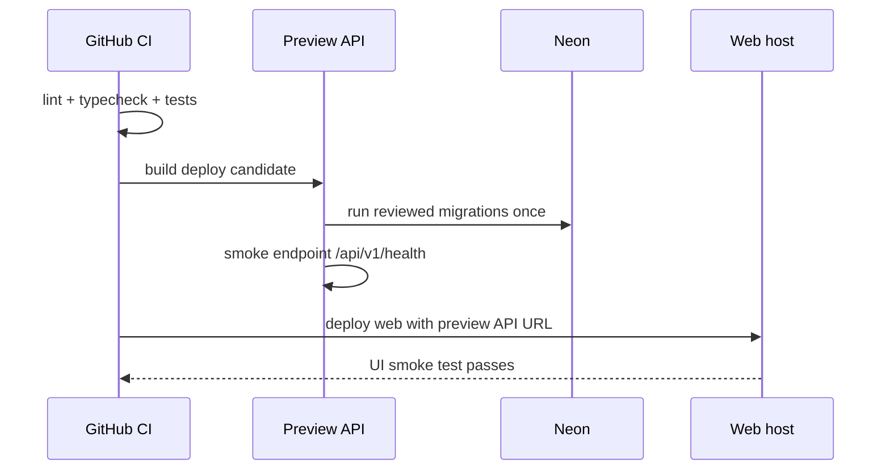

# Deployment Runbook

## 1. Target minimal

| Komponen   | Local             | Preview                    | Production                    |
| ---------- | ----------------- | -------------------------- | ----------------------------- |
| API NestJS | pnpm dev          | Docker/managed web service | Docker/managed web service    |
| Web Vite   | pnpm dev          | Static host                | Static host                   |
| Database   | Docker Postgres   | Neon non-production        | Neon production `job_tracker` |
| Email      | log/sandbox       | sandbox                    | verified sending domain       |
| Mobile     | Expo Go/dev build | EAS preview opsional       | EAS production build          |

Backend hosting dipilih setelah baseline berjalan; pilih satu provider yang mendukung Docker/Node dan environment variable. Jangan pindah provider di tengah implementasi MVP tanpa alasan operasional yang jelas.

## 2. Environment variable contract

```dotenv
# API
APP_ENV=local
NODE_ENV=development
PORT=3000
DATABASE_URL=postgresql://...
JWT_ACCESS_SECRET=replace-with-long-random-secret
JWT_REFRESH_SECRET=replace-with-long-random-secret
WEB_ORIGIN=http://localhost:5173
EMAIL_FROM=Job Tracker <no-reply@notify.example.com>
EMAIL_PROVIDER=development
EMAIL_PROVIDER_API_KEY=
APP_BASE_URL=http://localhost:5173
REMINDER_BATCH_SIZE=25

# Web
VITE_API_BASE_URL=http://localhost:3000/api/v1

# Mobile
EXPO_PUBLIC_API_BASE_URL=http://LAN-OR-PREVIEW-URL/api/v1
```

Hanya variable `VITE_*` dan `EXPO_PUBLIC_*` yang boleh masuk client. Database URL, JWT secret, dan API key email hanya berada di API runtime.

`APP_ENV` wajib memakai `local`, `preview`, atau `production`. Bila belum diisi, runtime mempertahankan fallback aman: `NODE_ENV=production` dianggap production, selain itu local. Preview sebaiknya memakai `NODE_ENV=production` dan `APP_ENV=preview` agar runtime tetap optimized tetapi boleh memakai adapter email no-send.

`EMAIL_PROVIDER=development` hanya untuk local/preview aman dan tidak mengirim email nyata. `APP_ENV=production` menolaknya secara fail-closed dan wajib memakai `EMAIL_PROVIDER=resend`, API key server-side, sender domain terverifikasi, serta `APP_BASE_URL` HTTPS. `REMINDER_BATCH_SIZE` menerima integer 1–100.

## 3. Kandidat container M8

Build dari root repository:

```powershell
docker build -f apps/api/Dockerfile -t sei-api:m8 .
docker build -f apps/web/Dockerfile --build-arg VITE_API_BASE_URL=https://api-preview.example.com/api/v1 -t sei-web:m8 .
```

- API membuka port `3000`, berjalan sebagai user non-root, dan memeriksa `/api/v1/health` dari Docker healthcheck.
- Web membuka port `8080`, berjalan sebagai user Nginx non-root, menyediakan `/health` untuk container/orchestrator, dan memakai SPA fallback ke `index.html`.
- `VITE_API_BASE_URL` pada image web wajib berupa HTTPS tanpa credential/query/fragment serta berakhir dengan `/api/v1`.
- Image API default ke `APP_ENV=production`. Preview harus mengaturnya eksplisit menjadi `preview`; kelalaian konfigurasi akan gagal tertutup bila email no-send dipilih.

Runtime image API menyediakan dua perintah penting dari working directory `/app`:

```text
node dist/drizzle/migrate.js  # release command satu kali
node dist/main.js             # start command
```

## 4. Release sequence



Setelah URL HTTPS tersedia, jalankan smoke tanpa credential akun:

```powershell
$env:PREVIEW_API_BASE_URL = 'https://api-preview.example.com/api/v1'
$env:PREVIEW_WEB_URL = 'https://web-preview.example.com'
pnpm smoke:preview
```

## 5. Migration safety

- Backup/export penting sebelum migration material.
- CI hanya menjalankan migration check pada database ephemeral/preview, bukan Neon production secara otomatis sebelum strategi release ditetapkan.
- Production migration dilakukan satu kali oleh pipeline/release command terkontrol, lalu health check.
- Jika migration gagal, hentikan deploy; jangan mencoba drop table atau rollback SQL sembarang.

## 6. Operational checklist

- [ ] Domain API memakai HTTPS.
- [ ] Web origin yang diizinkan sudah benar.
- [ ] Credential production berbeda dari preview.
- [ ] Database dan email credential tidak pernah di-client.
- [ ] Email sender domain sudah diverifikasi dan ada SPF/DKIM sesuai provider.
- [ ] Endpoint `/api/v1/health` tidak membocorkan secret atau data user.
- [ ] Log memiliki request ID dan masking credential.
- [ ] Ada jalur rollback aplikasi; migration destructive punya runbook sendiri.
