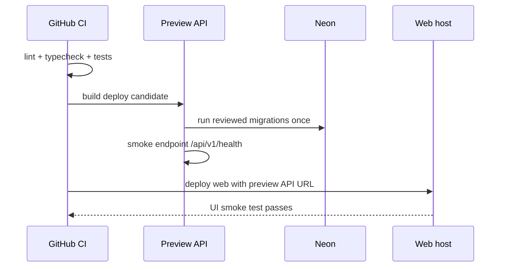

# Deployment Runbook

## 1. Target minimal

| Komponen   | Local             | Preview                    | Production                    |
| ---------- | ----------------- | -------------------------- | ----------------------------- |
| API NestJS | pnpm dev          | Docker/managed web service | Docker/managed web service    |
| Web Vite   | pnpm dev          | Static host                | Static host                   |
| Database   | Docker Postgres   | Neon non-production        | Neon production `job_tracker` |
| Email      | log/sandbox       | sandbox                    | verified sending domain       |
| Mobile     | Expo Go/dev build | EAS preview opsional       | EAS production build          |

Backend hosting dipilih setelah baseline berjalan; pilih satu provider yang mendukung Docker/Node dan environment variable. Jangan pindah provider di tengah implementasi MVP tanpa alasan operasional yang jelas.

## 2. Environment variable contract

```dotenv
# API
APP_ENV=local
NODE_ENV=development
PORT=3000
DATABASE_URL=postgresql://...
JWT_ACCESS_SECRET=replace-with-long-random-secret
JWT_REFRESH_SECRET=replace-with-long-random-secret
WEB_ORIGIN=http://localhost:5173
EMAIL_FROM=Job Tracker <no-reply@notify.example.com>
EMAIL_PROVIDER=development
EMAIL_PROVIDER_API_KEY=
APP_BASE_URL=http://localhost:5173
REMINDER_BATCH_SIZE=25

# Web
VITE_API_BASE_URL=http://localhost:3000/api/v1

# Mobile
EXPO_PUBLIC_API_BASE_URL=http://LAN-OR-PREVIEW-URL/api/v1
```

Hanya variable `VITE_*` dan `EXPO_PUBLIC_*` yang boleh masuk client. Database URL, JWT secret, dan API key email hanya berada di API runtime.

`APP_ENV` wajib memakai `local`, `preview`, atau `production`. Bila belum diisi, runtime mempertahankan fallback aman: `NODE_ENV=production` dianggap production, selain itu local. Preview sebaiknya memakai `NODE_ENV=production` dan `APP_ENV=preview` agar runtime tetap optimized tetapi boleh memakai adapter email no-send.

`EMAIL_PROVIDER=development` hanya untuk local/preview aman dan tidak mengirim email nyata. `APP_ENV=production` menolaknya secara fail-closed dan wajib memakai `EMAIL_PROVIDER=resend`, API key server-side, sender domain terverifikasi, serta `APP_BASE_URL` HTTPS. `REMINDER_BATCH_SIZE` menerima integer 1–100.

Kontrak production tambahan sejak M9:

- `EMAIL_FROM` untuk provider Resend wajib berformat `Nama <alamat@domain>` atau alamat email polos yang dapat diparse, dan domain pengirim tidak boleh placeholder (`example.com`, `example.org`, `example.net`, `localhost`, `invalid`, `test`). Validasi ini fail-closed saat adapter dibuat, bukan saat email pertama dikirim.
- Credential production wajib berbeda dari preview; `JWT_ACCESS_SECRET`, `JWT_REFRESH_SECRET`, `DATABASE_URL`, dan `EMAIL_PROVIDER_API_KEY` tidak boleh dipakai ulang antar environment.
- Nilai production disimpan hanya di secret manager provider hosting; tidak pernah masuk git, client code, log, atau response.

## 3. Kandidat container M8

Build dari root repository:

```powershell
docker build -f apps/api/Dockerfile -t sei-api:m8 .
docker build -f apps/web/Dockerfile --build-arg VITE_API_BASE_URL=https://api-preview.example.com/api/v1 -t sei-web:m8 .
```

- API membuka port `3000`, berjalan sebagai user non-root, dan memeriksa `/api/v1/health` dari Docker healthcheck.
- Web membuka port `8080`, berjalan sebagai user Nginx non-root, menyediakan `/health` untuk container/orchestrator, dan memakai SPA fallback ke `index.html`.
- `VITE_API_BASE_URL` pada image web wajib berupa HTTPS tanpa credential/query/fragment serta berakhir dengan `/api/v1`.
- Image API default ke `APP_ENV=production`. Preview harus mengaturnya eksplisit menjadi `preview`; kelalaian konfigurasi akan gagal tertutup bila email no-send dipilih.

Runtime image API menyediakan dua perintah penting dari working directory `/app`:

```text
node dist/drizzle/migrate.js  # release command satu kali
node dist/main.js             # start command
```

## 4. Domain email production (M9)

Reminder production dikirim dari domain pengirim khusus yang terverifikasi di Resend, bukan domain pribadi atau shared domain provider.

1. Pilih subdomain pengirim khusus, misalnya `notify.morriztech.cloud`; jangan mengirim dari apex domain yang dipakai untuk korespondensi pribadi.
2. Daftarkan domain tersebut di dashboard Resend (Domains → Add Domain) dan salin record DNS yang diberikan.
3. Tambahkan record DNS pada provider DNS: record `DKIM` (TXT) wajib; tambahkan `SPF` (TXT `v=spf1 include:...`) pada subdomain pengirim; pasang `DMARC` (TXT `_dmarc`) minimal dengan policy monitoring `p=none` sebelum dinaikkan bertahap ke `quarantine`.
4. Tunggu status domain menjadi `verified` di Resend sebelum menjalankan release command production.
5. Set `EMAIL_FROM=Sei <no-reply@notify.example.com>` (ganti dengan domain terverifikasi yang nyata), `EMAIL_PROVIDER=resend`, dan `EMAIL_PROVIDER_API_KEY` production yang berbeda dari preview.
6. Bukti verifikasi: kirim satu email uji dari adapter Resend terhadap reminder uji pada deployment production, lalu konfirmasi `providerMessageId` tersimpan dan email sampai.

API menolak start bila `EMAIL_FROM` memakai domain placeholder atau tidak dapat diparse saat `EMAIL_PROVIDER=resend`, sehingga kesalahan konfigurasi terlihat saat boot, bukan saat reminder pertama gagal.

## 5. Release sequence



Setelah URL HTTPS tersedia, jalankan smoke tanpa credential akun:

```powershell
$env:PREVIEW_API_BASE_URL = 'https://api-preview.example.com/api/v1'
$env:PREVIEW_WEB_URL = 'https://web-preview.example.com'
pnpm smoke:preview
```

### Smoke production (M9)

Runner smoke yang sama mendukung target production lewat variable terpisah; tepat satu pasangan target (preview **atau** production) harus diisi:

```powershell
$env:PRODUCTION_API_BASE_URL = 'https://api.example.com/api/v1'
$env:PRODUCTION_WEB_URL = 'https://app.example.com'
pnpm smoke:production
```

Validasi identik dengan preview: HTTPS wajib, tanpa credential/query/fragment, API base berakhir `/api/v1`, timeout 10 detik, respons health persis `{ "status": "ok" }`, dan shell HTML Sei. `--validate-config` tetap tersedia untuk validasi tanpa request jaringan.

### Urutan release production

1. Pastikan gate preview M8 operationally complete dan CI hijau pada commit release.
2. Verifikasi domain email production (§4) dan isi secret production di secret manager provider.
3. Jalankan backup/export database production sesuai [Backup & Restore Runbook](BACKUP_RESTORE_RUNBOOK.md) sebelum migration apa pun.
4. Jalankan release command migration satu kali (`node dist/drizzle/migrate.js`) terhadap Neon production.
5. Deploy API dengan `APP_ENV=production`, `NODE_ENV=production`, origin/secret production; konfirmasi `GET /api/v1/health` mengembalikan `{ "status": "ok" }`.
6. Deploy web dengan `VITE_API_BASE_URL` HTTPS production.
7. Jalankan `pnpm smoke:production` dan simpan bukti outputnya.
8. Tandai item pada [Release Checklist](RELEASE_CHECKLIST.md); production dinyatakan rilis hanya setelah checklist disetujui.

## 6. Migration safety

- Backup/export **wajib** sebelum migration material apa pun pada database preview maupun production (lihat [Backup & Restore Runbook](BACKUP_RESTORE_RUNBOOK.md)).
- CI hanya menjalankan migration check pada database ephemeral/preview, bukan Neon production secara otomatis sebelum strategi release ditetapkan.
- Production migration dilakukan satu kali oleh pipeline/release command terkontrol, lalu health check.
- Jika migration gagal, hentikan deploy; jangan mencoba drop table atau rollback SQL sembarang.

## 7. Rollback path

Rollback aplikasi dan rollback database adalah dua jalur berbeda:

- **Rollback aplikasi**: redeploy image/container versi sebelumnya (API dan web) dengan environment variable yang sama. Simpan tag image per release agar versi sebelumnya selalu tersedia. Image tidak menyimpan state, sehingga rollback aplikasi tidak menyentuh data.
- **Rollback database**: schema tidak di-rollback dengan menulis SQL terbalik sembarangan. Pulihkan dari backup/PITR Neon sesuai [Backup & Restore Runbook](BACKUP_RESTORE_RUNBOOK.md) hanya setelah akar masalah dipahami. Migration destruktif apa pun wajib punya runbook tersendiri yang disetujui sebelum dijalankan.
- Setelah rollback apa pun, jalankan smoke runner terhadap target yang bersangkutan dan catat buktinya.

## 8. Operational checklist

Checklist lengkap dengan sign-off ada di [Release Checklist](RELEASE_CHECKLIST.md). Ringkasan item wajib:

- [ ] Domain API memakai HTTPS.
- [ ] Web origin yang diizinkan sudah benar.
- [ ] Credential production berbeda dari preview.
- [ ] Database dan email credential tidak pernah di-client.
- [ ] Email sender domain sudah diverifikasi dan ada SPF/DKIM/DMARC sesuai provider.
- [ ] Endpoint `/api/v1/health` tidak membocorkan secret atau data user.
- [ ] Log memiliki request ID dan masking credential.
- [ ] Backup/restore runbook sudah diuji minimal satu kali pada database non-production.
- [ ] Ada jalur rollback aplikasi; migration destructive punya runbook sendiri.

## 9. Jalur preview gratis (Neon + Render + Netlify)

Jalur ini menutup gate eksternal M8 tanpa biaya: Neon free (database), Render free (API Docker), Netlify free (web static). Semua HTTPS otomatis. Konfigurasi sudah ter-commit: `render.yaml` (Blueprint API) dan `netlify.toml` (build web + proxy `/api/v1`).

Catatan arsitektur: cookie refresh web memakai `sameSite=lax`, sehingga web dan API **wajib satu site**. Karena itu Netlify me-proxy `/api/v1/*` ke API Render (`netlify.toml`); web memakai `VITE_API_BASE_URL` yang menunjuk ke domain Netlify itu sendiri. Mobile tidak terdampak karena memakai JSON refresh token dan menembak URL API Render langsung.

### Langkah eksekusi

1. **Neon**: buat project baru (free), database `job_tracker`, region terdekat. Salin connection string pooled. Ini credential preview — berbeda dari production nanti.
2. **Migration preview** (dari lokal, satu kali):

   ```powershell
   $env:DATABASE_URL = '<neon-preview-connection-string>'
   pnpm --filter @sei/api db:migrate
   ```

3. **Render**: Dashboard → New → Blueprint → pilih repo; blueprint `render.yaml` membuat service Docker `sei-api-preview` plan free dengan health check `/api/v1/health`. Isi env `sync: false` di dashboard: `DATABASE_URL` (Neon), `WEB_ORIGIN` dan `APP_BASE_URL` (URL Netlify dari langkah 4). JWT secret di-generate otomatis. URL hasil: `https://sei-api-preview.onrender.com`.
4. **Netlify**: Add new site → Import from Git → repo ini; `netlify.toml` terdeteksi otomatis. Set site name (misal `sei-web-preview`), lalu set environment variable `VITE_API_BASE_URL=https://<site-name>.netlify.app/api/v1` dan trigger deploy ulang. Bila nama service Render berbeda dari `sei-api-preview`, sesuaikan target redirect di `netlify.toml` dulu.
5. **Smoke preview** (dari lokal):

   ```powershell
   $env:PREVIEW_API_BASE_URL = 'https://sei-api-preview.onrender.com/api/v1'
   $env:PREVIEW_WEB_URL = 'https://<site-name>.netlify.app'
   pnpm smoke:preview
   ```

6. **GitHub environment**: buat environment `preview` di repo settings dengan variable `API_BASE_URL` dan `WEB_URL` di atas, lalu jalankan workflow `release.yml` target `preview` sebagai bukti gate.
7. **Mobile**: set `EXPO_PUBLIC_API_BASE_URL=https://sei-api-preview.onrender.com/api/v1` untuk build preview.

### Batasan free plan yang harus diterima

- Render free tidur setelah 15 menit tanpa traffic; cold start 30–60 detik. Smoke runner membatasi timeout 10 detik, jadi **hangatkan dulu** dengan membuka `https://sei-api-preview.onrender.com/api/v1/health` di browser sebelum menjalankan `pnpm smoke:preview`.
- Scheduler reminder ikut tidur bersama instance; reminder preview bisa terlambat sampai instance bangun. Ini hilang saat pindah ke VPS always-on.
- Email preview memakai provider `development` (no-send) sesuai kontrak `APP_ENV=preview`.

Setelah smoke preview dan workflow `release.yml` hijau, tandai gate eksternal M8 nomor 2–7 tertutup di `HANDOFF_M8.md`. Migrasi ke VPS production tinggal mengganti target deploy karena image provider-agnostic.
