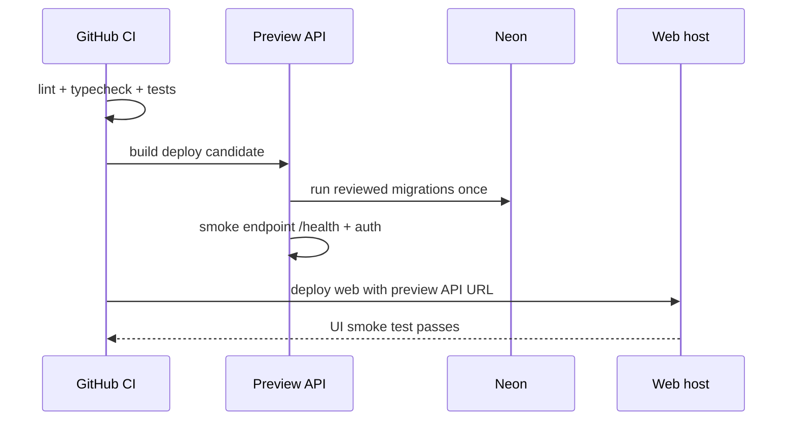

# Deployment Runbook

## 1. Target minimal

| Komponen   | Local             | Preview                    | Production                    |
| ---------- | ----------------- | -------------------------- | ----------------------------- |
| API NestJS | pnpm dev          | Docker/managed web service | Docker/managed web service    |
| Web Vite   | pnpm dev          | Static host                | Static host                   |
| Database   | Docker Postgres   | Neon non-production        | Neon production `job_tracker` |
| Email      | log/sandbox       | sandbox                    | verified sending domain       |
| Mobile     | Expo Go/dev build | EAS preview opsional       | EAS production build          |

Backend hosting dipilih setelah baseline berjalan; pilih satu provider yang mendukung Docker/Node dan environment variable. Jangan pindah provider di tengah implementasi MVP tanpa alasan operasional yang jelas.

## 2. Environment variable contract

```dotenv
# API
NODE_ENV=development
PORT=3000
DATABASE_URL=postgresql://...
JWT_ACCESS_SECRET=replace-with-long-random-secret
JWT_REFRESH_SECRET=replace-with-long-random-secret
WEB_ORIGIN=http://localhost:5173
EMAIL_FROM=Job Tracker <no-reply@notify.example.com>
EMAIL_PROVIDER=development
EMAIL_PROVIDER_API_KEY=
APP_BASE_URL=http://localhost:5173
REMINDER_BATCH_SIZE=25

# Web
VITE_API_BASE_URL=http://localhost:3000/api/v1

# Mobile
EXPO_PUBLIC_API_BASE_URL=http://LAN-OR-PREVIEW-URL/api/v1
```

Hanya variable `VITE_*` dan `EXPO_PUBLIC_*` yang boleh masuk client. Database URL, JWT secret, dan API key email hanya berada di API runtime.

`EMAIL_PROVIDER=development` hanya untuk local/preview aman dan tidak mengirim email nyata. Production wajib memakai `EMAIL_PROVIDER=resend`, API key server-side, sender domain terverifikasi, dan `APP_BASE_URL` HTTPS. `REMINDER_BATCH_SIZE` menerima integer 1–100.

## 3. Release sequence



## 4. Migration safety

- Backup/export penting sebelum migration material.
- CI hanya menjalankan migration check pada database ephemeral/preview, bukan Neon production secara otomatis sebelum strategi release ditetapkan.
- Production migration dilakukan satu kali oleh pipeline/release command terkontrol, lalu health check.
- Jika migration gagal, hentikan deploy; jangan mencoba drop table atau rollback SQL sembarang.

## 5. Operational checklist

- [ ] Domain API memakai HTTPS.
- [ ] Web origin yang diizinkan sudah benar.
- [ ] Credential production berbeda dari preview.
- [ ] Database dan email credential tidak pernah di-client.
- [ ] Email sender domain sudah diverifikasi dan ada SPF/DKIM sesuai provider.
- [ ] Endpoint `/health` tidak membocorkan secret atau data user.
- [ ] Log memiliki request ID dan masking credential.
- [ ] Ada jalur rollback aplikasi; migration destructive punya runbook sendiri.
