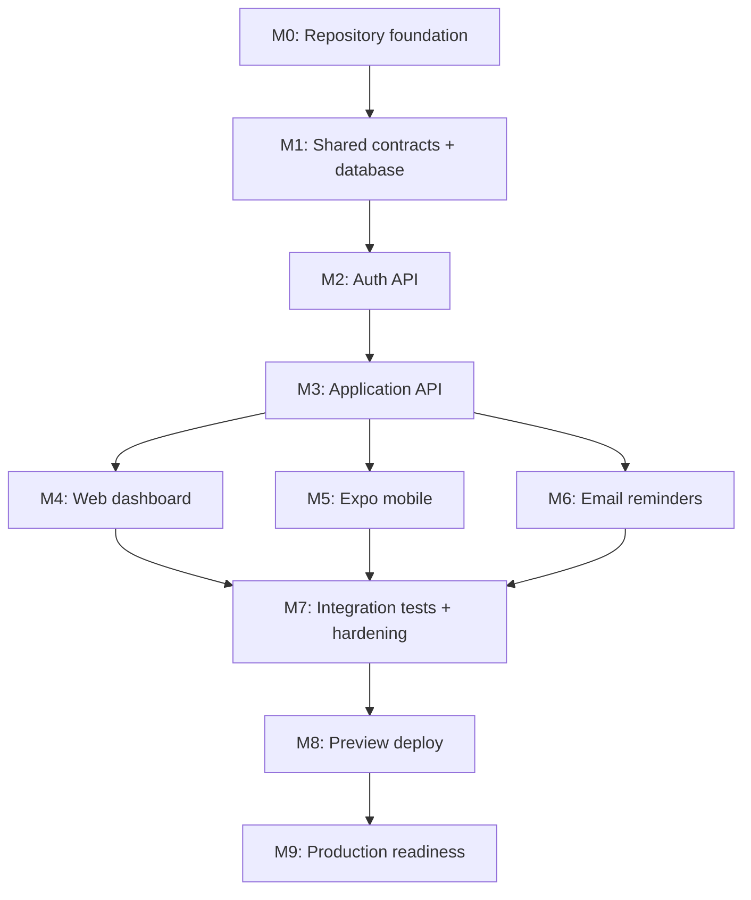

# Implementation Roadmap

## Timeline dependency map

| Milestone | Deliverable | Definition of done |
| --- | --- | --- |
| M0 | pnpm monorepo, lint, TS strict, env example, CI skeleton | Semua app build/lint kosong berhasil |
| M1 | Drizzle schema, migrations, seed, Studio local | Local DB migrates; schema reviewed |
| M2 | Auth module + refresh rotation | Register/login/refresh/logout tests lulus |
| M3 | CRUD applications, notes, contacts, activities | Ownership, filters, pagination, status activity tested |
| M4 | Web dark dashboard + forms | Web dapat mengelola data dari API nyata |
| M5 | Expo auth + list/detail/form | Akun dan data sama dengan web |
| M6 | Reminder schedule + email adapter | Due reminder terkirim sekali dan retry teruji |
| M7 | E2E smoke test, validation, security review | Critical flows hijau; no known P0/P1 |
| M8 | Preview environment + Neon non-prod | Migration dan smoke test deploy lulus |
| M9 | Domain email, backup/runbook, production deploy | Checklist release disetujui |

## Guardrails per milestone

1. Kerjakan satu milestone penuh, jangan campur refactor besar dari milestone berikutnya.
2. Setelah migration pernah dipakai, jangan edit migration lama; buat migration baru.
3. Commit setelah lint/test milestone lulus. Format commit: `feat(applications): add create and list endpoints`.
4. Bila AI menemukan ambiguity, update docs dahulu sebelum mengubah kode.
