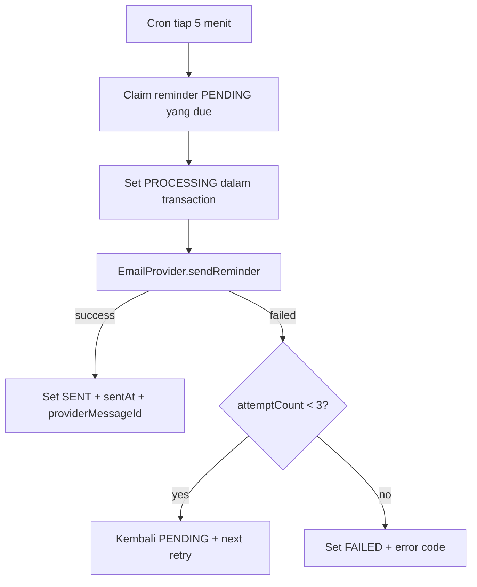

# Email Reminder Design

## 1. Keputusan MVP

Reminder dikirim lewat email saja. Mobile tetap bisa membuka daftar deadline, tetapi tidak mengirim push pada fase ini.

Email harus lewat abstraction `EmailProvider`; aplikasi tidak boleh mengikat business logic ke satu SDK vendor.

```ts
export interface EmailProvider {
  sendReminder(input: {
    to: string;
    subject: string;
    applicationTitle?: string;
    organizationName?: string;
    dueAt: Date;
    reminderKind: 'DEADLINE' | 'FOLLOW_UP' | 'INTERVIEW' | 'CUSTOM';
  }): Promise<{ providerMessageId: string }>;
}
```

Provider awal dapat memakai layanan email transactional dengan development sandbox dan domain production terverifikasi. Saat deploy, gunakan subdomain pengirim khusus, misalnya `notify.morriztech.cloud`; jangan memakai password Gmail pribadi sebagai SMTP credential aplikasi.

## 2. Scheduler flow



## 3. Ketentuan penting

- Scheduler meng-claim record secara atomik agar dua instance API tidak mengirim email ganda.
- Due time dan delivery dicatat UTC; template email menampilkan zona waktu user.
- Reminder `CANCELLED`, `SENT`, atau milik application terhapus tidak boleh dikirim.
- `attemptCount`, `lastErrorCode`, dan `providerMessageId` disimpan untuk debugging tanpa menyimpan isi email sensitif di log.
- Pada deployment satu instance, Nest Schedule cukup. Ketika API discale horizontal atau volume reminder meningkat, pindah ke BullMQ + Redis dengan idempotency key.

## 4. Template email minimal

Subject: `Reminder: {application title} {kind}`

Isi: nama user, judul role/proyek, organisasi, waktu deadline/follow-up, tautan langsung ke detail application. Tidak ada data password, token, atau catatan interview di body email.
