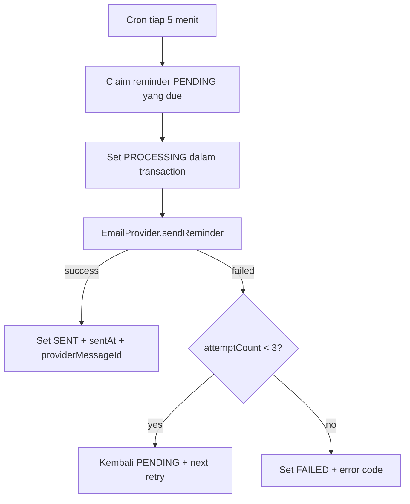

# Email Reminder Design

## 1. Keputusan MVP

Reminder dikirim lewat email saja. Mobile tetap bisa membuka daftar deadline, tetapi tidak mengirim push pada fase ini.

Email harus lewat abstraction `EmailProvider`; aplikasi tidak boleh mengikat business logic ke satu SDK vendor.

```ts
export interface EmailProvider {
  sendReminder(input: {
    idempotencyKey: string;
    to: string;
    subject: string;
    userDisplayName: string;
    applicationTitle?: string;
    organizationName?: string;
    dueAt: Date;
    timezone: string;
    applicationUrl?: string;
    reminderKind: "DEADLINE" | "FOLLOW_UP" | "INTERVIEW" | "CUSTOM";
  }): Promise<{ providerMessageId: string }>;
}
```

M6 menyediakan dua adapter: development adapter yang tidak mengirim email nyata dan Resend HTTP adapter untuk production. Pemilihan adapter memakai `EMAIL_PROVIDER=development|resend`. Resend memakai `EMAIL_PROVIDER_API_KEY` hanya di server dan meneruskan `idempotencyKey` sebagai header `Idempotency-Key`. Saat deploy, gunakan subdomain pengirim khusus, misalnya `notify.morriztech.cloud`; jangan memakai password Gmail pribadi sebagai SMTP credential aplikasi.

Idempotency key bersifat deterministik per reminder, dengan format `reminder:{reminderId}`. Saat attempt pertama di-claim, scheduler menyimpan snapshot payload minimum di `reminders.delivery_payload`; semua retry memakai snapshot yang sama. Reminder tidak dapat diedit setelah `attemptCount > 0`, tetapi masih dapat dibatalkan ketika kembali `PENDING`. Provider production wajib mendukung idempotency key; bila adapter baru tidak mendukungnya, adapter tersebut tidak boleh diaktifkan untuk scheduler.

## 2. Scheduler flow



## 3. Ketentuan penting

- Scheduler meng-claim record secara atomik agar dua instance API tidak mengirim email ganda.
- Scheduler hanya mengambil `PENDING`, melakukan row lock dengan `SKIP LOCKED`, membekukan payload delivery bila belum ada, lalu mengubahnya menjadi `PROCESSING` dan menaikkan `attemptCount` dalam transaction yang sama.
- Due time dan delivery dicatat UTC; template email menampilkan zona waktu user.
- Reminder `CANCELLED`, `SENT`, atau milik application terhapus tidak boleh dikirim.
- `attemptCount`, `lastErrorCode`, dan `providerMessageId` disimpan untuk debugging tanpa menyimpan isi email sensitif di log.
- Provider timeout atau error mengembalikan reminder ke `PENDING` selama `attemptCount < 3`; tick berikutnya melakukan retry dengan idempotency key yang sama. Percobaan ketiga yang gagal menjadi `FAILED`.
- Request provider dibatasi 10 detik agar satu koneksi yang menggantung tidak menahan seluruh batch scheduler.
- Create memakai advisory transaction lock per user dan menolak lebih dari 100 reminder aktif (`PENDING` + `PROCESSING`) agar database dan kuota provider tidak dapat diantrikan tanpa batas oleh satu akun.
- Pada deployment satu instance, Nest Schedule cukup. Ketika API discale horizontal atau volume reminder meningkat, pindah ke BullMQ + Redis dengan idempotency key.

## 4. Template email minimal

Subject: `Reminder: {application title} {kind}`

Isi: nama user, judul role/proyek, organisasi, waktu deadline/follow-up, tautan langsung ke detail application. Tidak ada data password, token, atau catatan interview di body email.
