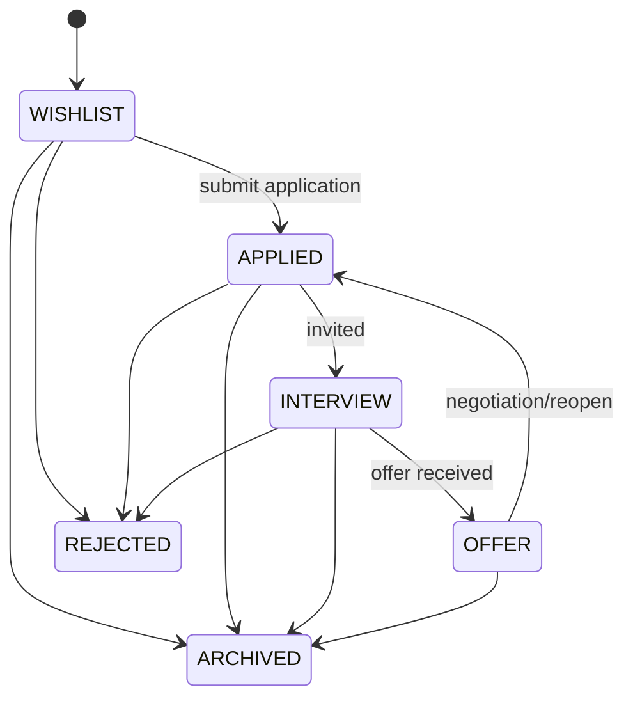
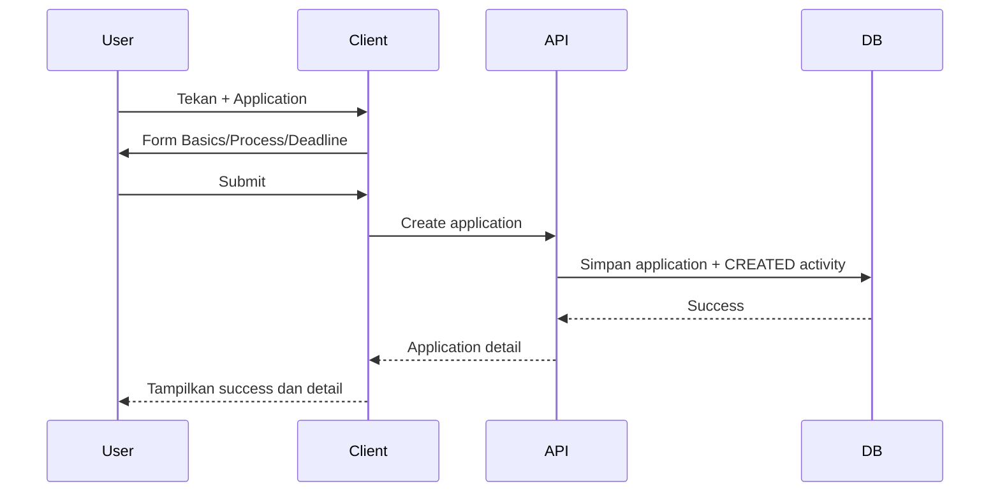

# User Flows and State

## 1. Application lifecycle

Status tidak dipaksa linear; application yang direopen bisa kembali ke tahap relevan. Archive adalah flag terpisah, bukan status baru.

## 2. Flow membuat lamaran

## 3. Flow status dan reminder

1. User mengubah status di halaman detail atau list cepat.
2. Client kirim patch hanya field yang berubah.
3. API cek ownership, validasi status, lalu menyimpan status dan `STATUS_CHANGED` activity dalam satu transaction.
4. Jika user memilih “buat follow-up reminder”, client memanggil endpoint reminder setelah application sukses tersimpan.
5. Dashboard invalidates/refetches summary serta daftar terkait.

## 4. State UI penting

| Situasi | Perilaku |
| --- | --- |
| Token access kedaluwarsa | Satu kali refresh; jika gagal, logout bersih ke login |
| Offline | Tampilkan data cache read-only dan indikator offline; create/edit ditunda untuk fase setelah MVP kecuali ada queue yang sengaja dibuat |
| Deadline lewat | Badge “Overdue”; jangan otomatis menghapus reminder/activity |
| API error | Pesan spesifik, input user tetap ada |
| Application kosong | Empty state + CTA tambah, bukan dashboard palsu |
