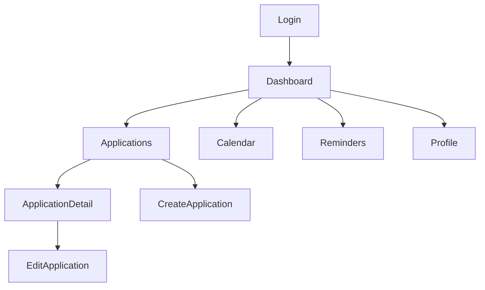

# UX/UI Design System — Dark Tech Dashboard

## 1. Arah desain

Tampilan harus terasa seperti control room personal: gelap, fokus, modern, namun tidak memakai neon berlebihan. Kontras dan keterbacaan lebih penting daripada gaya cyberpunk.

| Token | Nilai awal | Kegunaan |
| --- | --- | --- |
| `bg-canvas` | `#090B10` | Latar utama |
| `bg-surface` | `#11151D` | Card/panel |
| `bg-elevated` | `#181E29` | Modal/menu/input |
| `text-primary` | `#F4F7FB` | Teks utama |
| `text-muted` | `#98A2B3` | Metadata |
| `accent` | `#5B8CFF` | CTA/focus/active |
| `success` | `#35C28C` | Offer/success |
| `warning` | `#F7B955` | Deadline dekat |
| `danger` | `#F45D69` | Rejected/error |

Font web: Inter atau Geist. Mobile memakai system font Expo. Radius 10–14px, shadow tipis, border `rgba(255,255,255,.08)`.

## 2. Navigation map



## 3. Wireframe desktop

```text
┌────────────────────────────────────────────────────────────────────┐
│ JT  Dashboard  Applications  Calendar  Reminders       [Avatar ▾] │
├───────────────┬────────────────────────────────────────────────────┤
│ + Application │  Good evening, Morriz                               │
│               │  [12 Active] [3 Interview] [1 Offer] [2 Due soon] │
│ Filters       │                                                    │
│ • All         │  Upcoming                                          │
│ • Job         │  Sep 14  Backend Intern — technical test           │
│ • Internship  │  Sep 16  Freelance Web — follow-up                 │
│ • Freelance   │                                                    │
│               │  Recent applications                               │
│               │  Company / Role        Status       Deadline       │
└───────────────┴────────────────────────────────────────────────────┘
```

## 4. Wireframe mobile

```text
┌──────────────────────────────┐
│ Good evening, Morriz     [◉] │
│ 12 active  •  2 due soon     │
│                              │
│ UPCOMING                     │
│ Backend Intern               │
│ Technical test · in 2 days   │
│                              │
│ RECENT                       │
│ [Company] Frontend Intern    │
│ Applied · Sep 08             │
│                              │
│ [Dashboard][Jobs][Alerts][Me]│
│                  [+]         │
└──────────────────────────────┘
```

## 5. Komponen wajib

| Komponen | Web | Mobile | Catatan |
| --- | --- | --- | --- |
| App shell/navigation | Sidebar/topbar | Bottom tabs | Active route jelas |
| Application card/row | Table responsif + card | Card | Status, company, deadline |
| Status badge | shadcn Badge | Native chip | Bukan hanya warna; ada label |
| Form | RHF + Zod | RHF + Zod | Error dekat input |
| Date/time input | Popover calendar | native/date picker | Selalu tampilkan timezone |
| Empty state | CTA tambah application | CTA tambah application | Tidak menyalahkan user |
| Confirmation dialog | AlertDialog | Modal | Hapus/batalkan reminder |

## 6. Aksesibilitas dan responsif

- Minimal 4.5:1 kontras teks normal; jangan gunakan warna sebagai satu-satunya arti status.
- Keyboard navigation dan focus ring wajib di web.
- Target sentuh minimal 44px di mobile.
- Desktop memakai table untuk daftar padat; layar kecil berubah jadi card list, bukan horizontal scroll.
- Form panjang dibagi section: Basics, Process, Deadline, Notes.
